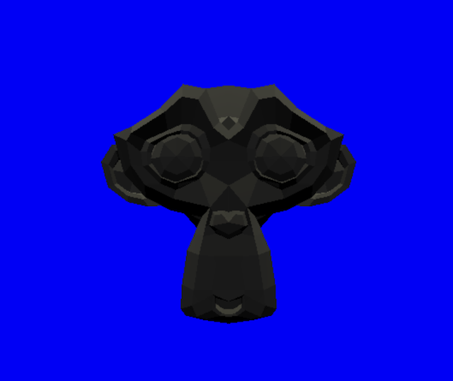

# three.js sample

[three.js]([three.js](https://threejs.org/)) を使用したサンプル



## 準備

1) Node.js のインストール

[https://nodejs.org/ja/](https://nodejs.org/ja/)から自分のPCにあったNode.jsをダウンロードしてインストールする

2) hello-threejs を clone する

```bash
$ git clone https://github.com/yamagame/hello-threejs.git
```

※ git コマンドがインストールされていない場合は[こちら](https://git-scm.com/book/ja/v2/%E4%BD%BF%E3%81%84%E5%A7%8B%E3%82%81%E3%82%8B-Git%E3%81%AE%E3%82%A4%E3%83%B3%E3%82%B9%E3%83%88%E3%83%BC%E3%83%AB)を参考にインストール

3) five-server を準備する

カレントディレクトリを hello-threejs にして下記のコマンドを実行

```bash
$ cd hello-threejs
$ npm install
```

4) five-server を起動する

```bash
$ npm start
```

## License

MIT